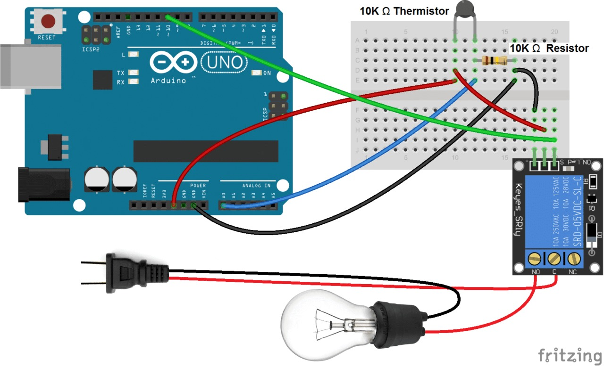
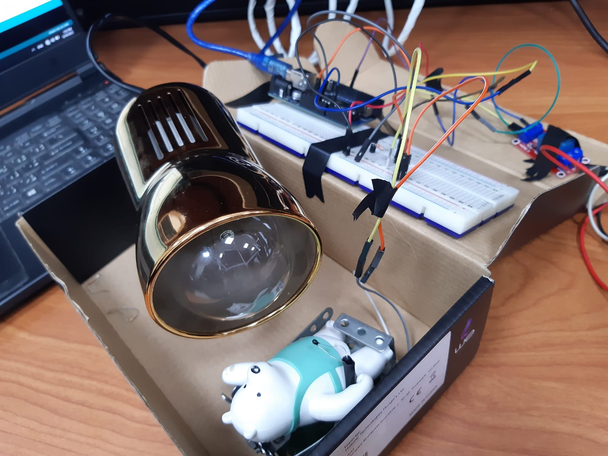

# Baby warmer system using Arduino and thermistor.
## **[To see Data sheet click here.](https://www.vishay.com/docs/29154/ntcle213e3.pdf)**
## Hardware requirments:
<ol>
  <li>Thermistor</li>
  <li>Arduino Uno board + cable. </li>
  <li>Fixed 10 KOhm resistor. </li>
  <li>Some jumper cables.</li>
  <li>Bread board </li>
  <li>5v 220V relay module</li>
  <li>100w lightbulb (or other similar heat source)</li>
  <li>Electrical housing to connect the lightbulb into</li>
  <li>Model bed + model baby (optional).</li>

</ol>

## Summary
The main purpose of this system is to keep the baby's environment at a suitable temperature (which is about 37.8C), this is done by measuring the ambient temperature using the thermistor and then using a heating element to raise this temperature until it reaches this threshold and occasionally turn on again to keep it in that range.

## Circuit Diagram

## Prototype photo

The sensor is placed on the baby's abdomen (modeled here by the doll). and the heating element is kept as close as possible to the baby to minimize heat loss.

## Code parts
### What the code does:
1. Measure the resistance of the thermistor (R2 in the code.)

3. Calculate the temperature kelvin and convert to celsius.
4. control the heating element until it reaches desired range.
it turns on the heat if temperature is below minimum value of the range and then turn it off when it reaches maximum value of the range..  
in this case it's called (min_temp and max_temp respectively).

#### Measuring the resistance of the thermistor.

it's a basic voltage divider circuit, the analog pin measures the voltage across the 10k resistor and then we calculate the thermistor resistance (noted R2),

#### Measuring the temperature

The formula used is standard for these types of sensors, called the stein-hart equation, there's a lot of math there, but most of it is boring, for now, this works accurately enough.  
The response time is about 1 to 4 seconds (according to the datasheet.), which is more than fast enough for this application.
### Limitations
- If you're going to be working in a cold environment, use a suitable heating element.

When we first assembled the prototype it was about 9 Degrees celsius, and the bulb couldn't heat the baby over 34 degrees because a lot of the heat was being lost to the atmosphere.

- Power consumption is really really high.

The heating element in our prototype (and also, any other device) consumes a lot of power, in our case we were using 100 watts to heat the baby, which is a lot in terms of electric power consumption.
(for reference, that's equivalent to 10 LED bulbs.)
